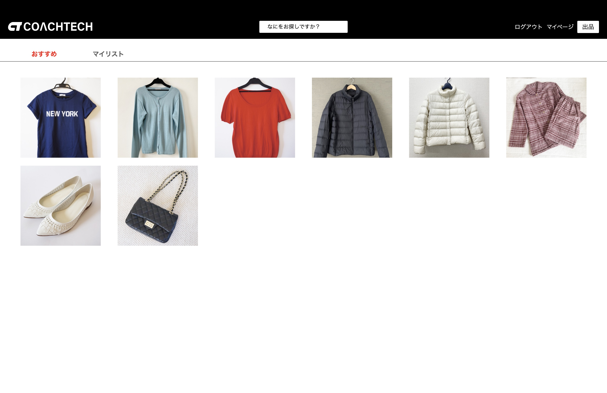

# flea-market
ある企業が開発した独自のフリマアプリです


## 作成した目的
coachtechブランドのアイテムを出品するため

## アプリケーションURL
### 開発環境
- ユーザー用ページ http://localhost/
- 管理者用ページ http://localhost/admin/index：：：未作成

### 本番環境
- ユーザー用ページ http://43.207.115.202/：：：未作成
- 管理者用ページ http://43.207.115.202/admin/index：：：未作成

### 動作確認用のアカウント
確認用のアカウントを用意していますので、下記のアカウントを使用してログインしてください。  
アカウントはユーザーと管理者の2種類です。  
- ユーザー メールアドレス：user01@example.com~user05@example.com
- 管理者 メールアドレス：admin@example.com  ：：：未作成
- パスワード（全アカウント共通）：coachtech

## 他のリポジトリ
該当なし

## 機能一覧
- 会員登録
- ログイン・ログアウト
- 商品の一覧と詳細の表示
- 商品の検索(商品名、カテゴリ)
- 商品のお気に入り追加と削除
- 商品のコメント追加と削除
- ユーザープロフィールの表示・編集
- ユーザー購入商品と出品商品の表示
- 商品の出品(画像の保存を含む)
- 商品の購入（配送先と支払い方法の選択・変更を含む）
- 管理者によるユーザーの削除、ユーザーコメントの削除
- 管理者による利用者へのメール送信

## 使用技術（実行環境）：：：未確認
- PHP 8.1.27
- Laravel 9.52.16
- MySQL 8.0.26

## テーブル設計
：：：未作成

## ER図
：：：未作成

## 環境構築：：：未完成

 1. ```docker-compose up -d --build```
 2. ```docker-compose exec php bash```
 3. ```composer install```
 4. .env.exampleファイルから.envを作成し、環境変数を変更  
DB_CONNECTIONからDB_PASSWORD、MAIL_MAILERからMAIL_FROM_NAMEの項目を修正  
STRIPE_KEYとSTRIPE_SECRETの項目を追加
 5. ```php artisan key:generate```
 6. ```php artisan migrate --seed```
アカウント、商品、注文データとその関連データが挿入されます
 7. ```php artisan storage:link```

## 補足事項
### 開発環境の構築について
仮想SMTPサーバーとしてMailtrapの使用を想定しています。  
Mailtrapを使用する場合はサービスの登録と.envファイルの編集が必要です。

決済機能としてstripeを設定しています。  
使用にはサービスの登録と.envファイルの記述が必要です。
